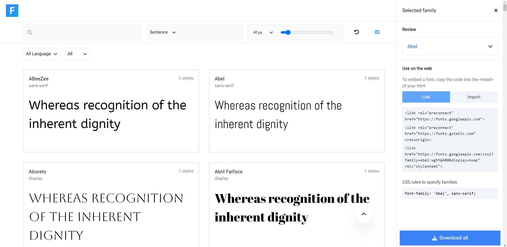
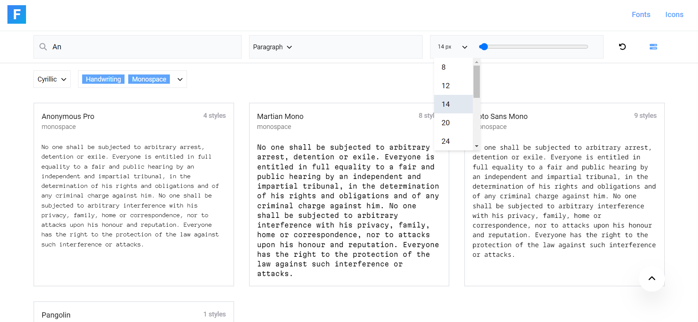
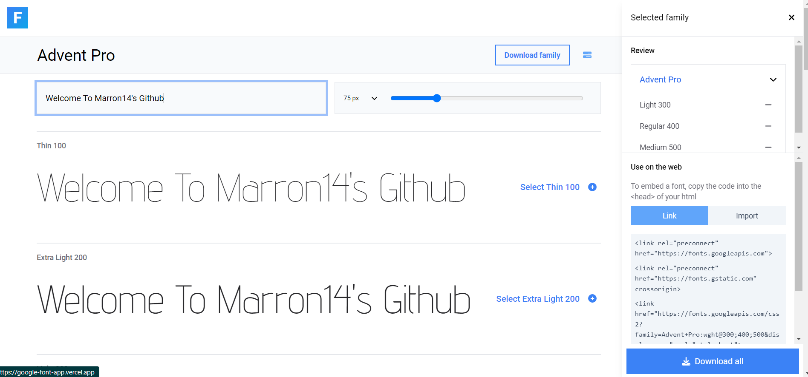

# GoogleFont clone



<!-- ABOUT THE PROJECT -->
<br/>

This is a clone of [Google Fonts](https://fonts.google.com/) website, created as a learning excercise and showcase my front-end development skills to potential employers. Most of the original website's functionalities is mimicked on this one.

- Website: https://google-font-app.vercel.app/

### Technologies

- [ReactJS + Vite](https://vitejs.dev/)
- [Google Fonts APIs](https://developers.google.com/fonts/docs/developer_api)
- [Axios](https://github.com/axios/axios)
- [React-Virtualized](https://github.com/bvaughn/react-virtualized)

## Features

- Optimized scrolling large list.
- A searchable and filterable list of all Google Font provided by Google.
- Sync state of filter options with URL params.
- Tool bar enable customizable font size and text for preview.
- Responsive design adapts to different screen sizes
- Generate embeded link for load font.

## Road Map

- [x] Font list
  - [x] Font search
  - [x] Type to Preview Text
  - [x] Ajust font size
  - [x] Fonts filter
  - [x] Sync filter URL
- [x] Font detail
  - [x] Type to Preview text
  - [x] Ajust font size
  - [x] Select font style
- [x] Font collection side bar
  - [x] Add, remove font style
  - [x] Display embeed link
  - [ ] Persistent collection
  - [ ] Download fonts
- [ ] ...

### Getting Started

#### Prerequisites

- NPM
- Clone this Repo

#### Installation

> At root directory

```sh
npm install
npm run dev
```

## Captured

> Filter font list
> 

> Font detail Page
> 

## Contributing

This project is a personal exercise and not actively seeking contributions. However, if you have suggestions for improvements or spot any issues with the website, feel free to submit an issue or pull request to [this Repo](https://github.com/tonible14012002/GoogleFontApp)
